# NUTI - Quantum Computing 

# Pre-requisites
* Python 3.6 or higher
* [Qiskit](https://qiskit.org/documentation/getting_started.html#installation)
* [Qiskit - Machine Learning](https://qiskit.org/documentation/machine-learning/getting_started.html#installation)

# Quantum Kernel Machine Learning
# Video

# Report

Check the notebook [here](./qiskit.ipynb).

## Kernel Machine Learning
Kernel methods are types of algorithms that are used for pattern analysis. They involve using linear classifiers to solve nonlinear problems and are based on the idea of a kernel function that maps the data into a higher dimensional space.

For many datasets, the datapoints are better understood in a highe  r dimensional feature space, through the use of a kernel function: $k(\vec{x}_i, \vec{x}_j) = \langle f(\vec{x}_i), f(\vec{x}_j) \rangle$, where $k$ is the kernel function, $\vec{x}_i, \vec{x}_j$ are $n$
dimensional inputs, $f$ is a map from $n$-dimensions to $m$-dimensions space and $\langle a,b \rangle$ denotes de dot product.

When considering finite data, a kernel function can be represented as a matrix: $K_{ij} = k(\vec{x}_i,\vec{x}_j)$.

## Quantum Kernel
A quantum feature map $\phi(\vec{x})$ is used to map a classical feature vector $\vec{x}$ to a quantum Hilbert space, $| \phi(\vec{x})\rangle \langle \phi(\vec{x})|$, such that $K_{ij} = \left| \langle \phi^\dagger(\vec{x}_j)| \phi(\vec{x}_i) \rangle \right|^{2}$.

## Classification
For this classification tutorial, we will use the _ad hoc dataset_, which generates a toy dataset that can be fully separated with `qiskit.circuit.library.ZZ_Feature_Map`, and the `scikit-learn` support vector machine (SVM) classifier.

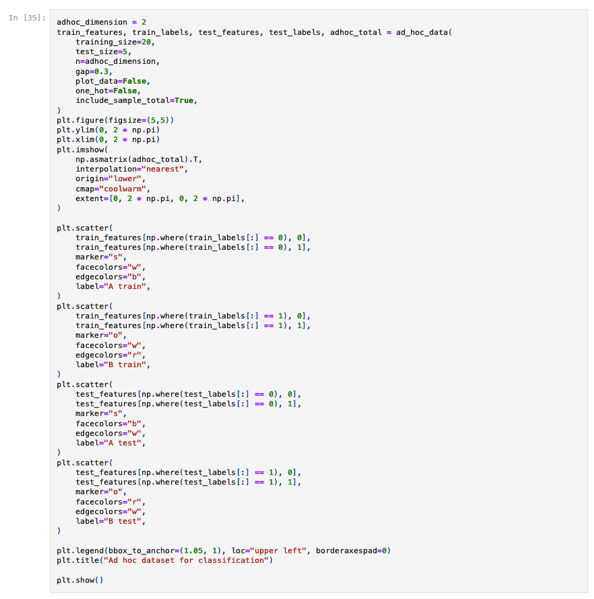

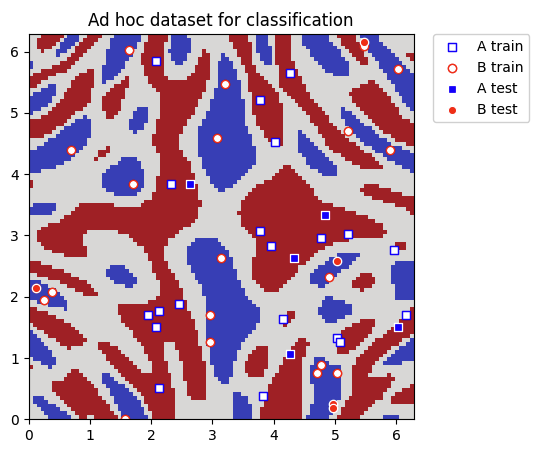

Once the training and testing datasets are ready, we can set up the `FidelityQuantumKernel` class to calculate
a kernel matrix using the `ZZFeatureMap`, second-order Pauli-Z evolution circuit. We use the reference implementation 
of the `Sampler` primitive and the `ComputeUncompute` fidelity that computes overlaps between states.

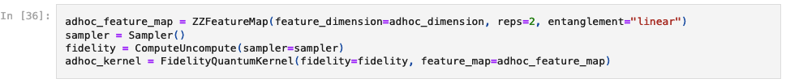

The `scikit-learn` `SVC` algorithm allows us to define a custom kernel in two ways:
* by providing the kernel as a callable function
 
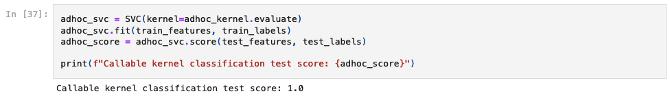
* by precomputing the kernel matrix
 
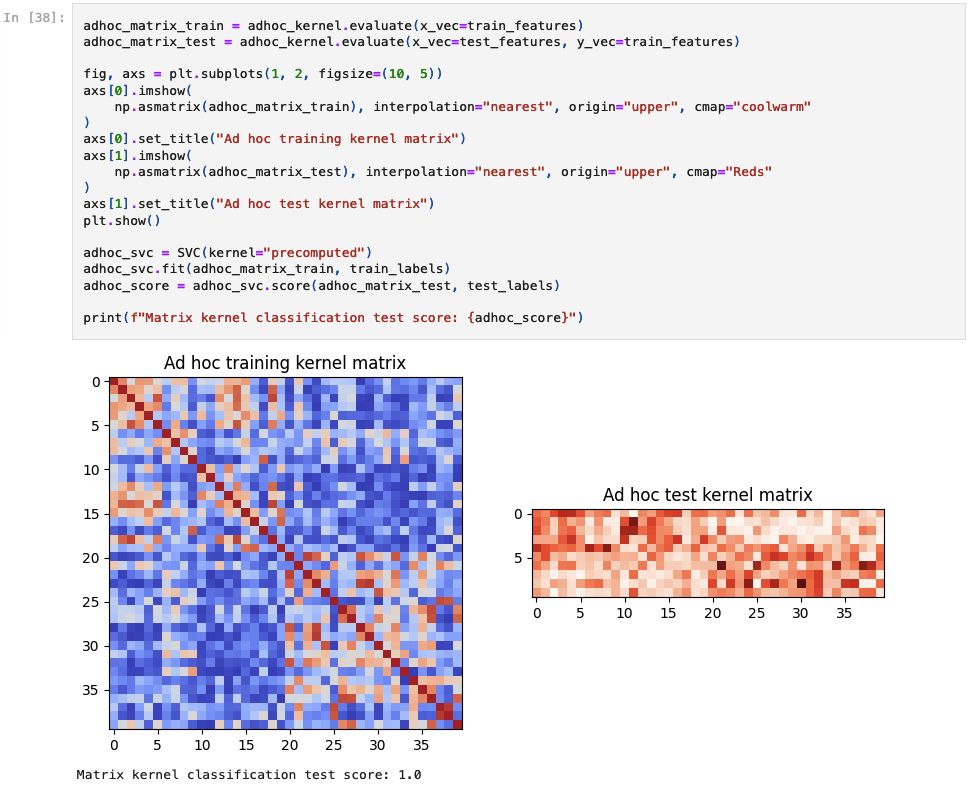

Qiskit Machine Learning also contains the `QSVC` class that extends the `SVC` class from `scikit-learn`.

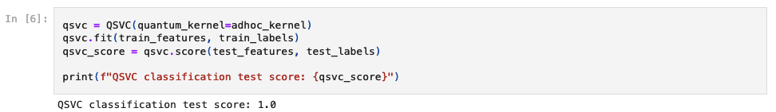

## Clustering
For clustering, again we will use the _ad hoc dataset_ and the `scikit-learn` `spectral` clustering algorithm.

We will need to regenerate the dataset with a larger gap between the two classes, and as clustering is an 
unsupervised machine learning task, no need for a test sample.

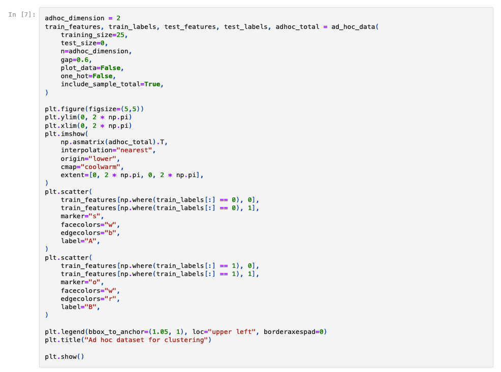

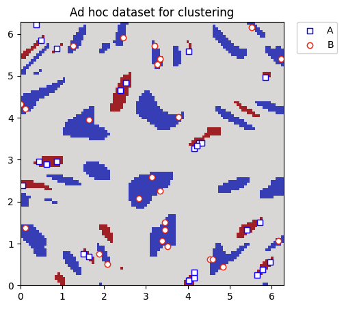

We set up again the `FidelityQuantumKernel` class to calculate a kernel matrix using the `ZZFeatureMap` with default values.

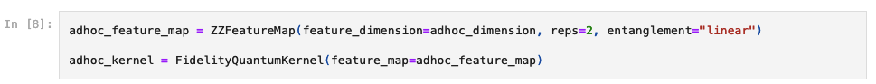

`scikit-learn` `spectral` clustering algorithm allows us to define a custom kernel in two ways:
* by providing the kernel as a callable function
* by precomputing the kernel matrix

By using the `FidelityQuantumKernel` class we can only use the second option, so we need to precompute the kernel matrix.

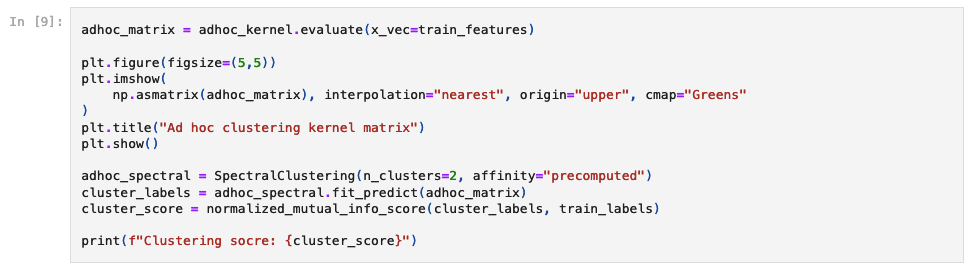

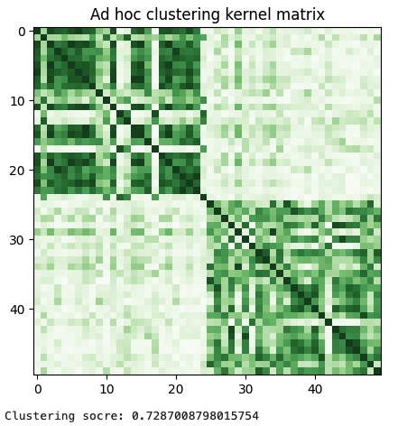

`scikit-learn` has also other algorithms that can use a precomputed kernel matrix:
* `Agglomerative clustering`
* `Support vector regression (SVR)`
* `Ridge regression`
* `Gaussian process regression (GPR)`
* `Principal component analysis (PCA)`

# License
[GNU GENERAL PUBLIC LICENSE](./LICENSE.MD)

# Author
* **Julián Benítez G.** - _Development_ - [julianbenitez99](https://github.com/julianbenitez99)